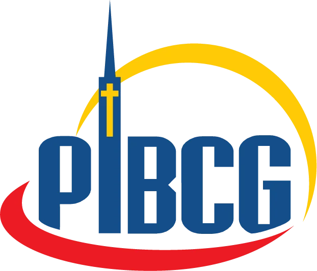

# Cartão de Decisão - PIBCG 🕊️

Projeto digital do **Cartão de Decisão** desenvolvido para a **Primeira Igreja Batista em Campo Grande (PIBCG)**. O objetivo é facilitar o registro de decisões espirituais, pedidos de oração e informações de visitantes da igreja.

---

## ✨ Funcionalidades

- ✅ Formulário digital responsivo baseado no cartão físico da PIBCG
- ✝️ Registro de decisões pessoais (aceitar Jesus, reconciliação, etc.)
- 🙏 Coleta de pedidos de oração com múltiplas opções
- 🏠 Informações detalhadas de endereço e contato
- 📞 Agendamento de visita ou conversa com liderança
- 📧 Envio automático das informações por e-mail

---

## 🧰 Tecnologias Utilizadas

- **HTML5** – Estrutura do formulário
- **CSS3** – Estilização responsiva
- **JavaScript (Vanilla)** – Lógica de envio e formatação dos dados
- **Node.js + Express** – Backend para envio de e-mails
